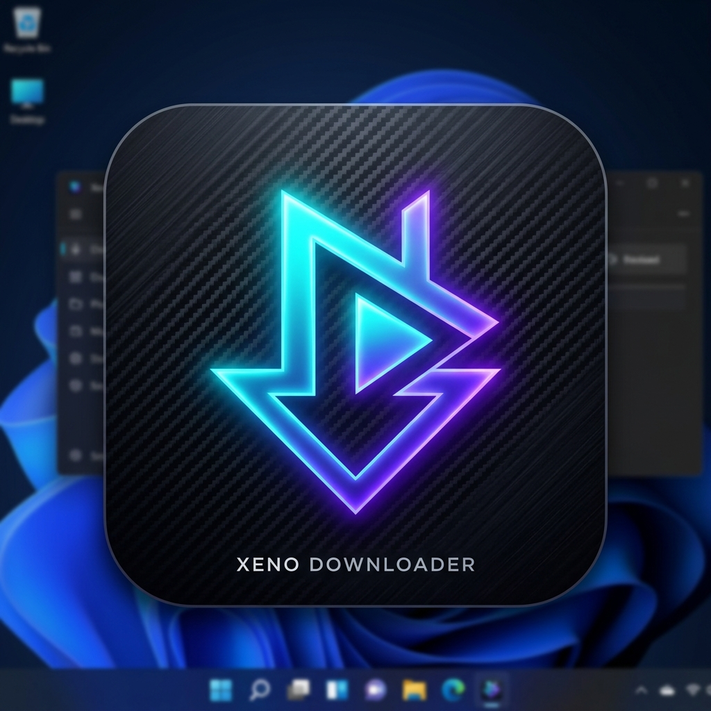

# Xeno Downloader

<p align="center">
  
</p>

<p align="center">
  <b>Modern, lightweight, high-performance native Windows desktop media downloader and browser.</b><br>
  Engineered in C# and .NET 8 WPF with Microsoft Edge WebView2 integration.
</p>

---

## ⚡ Highlights

- 🖥️ **100% Native Windows Application**: Built using C# and .NET 8 WPF for Windows 10 and Windows 11.
- 🚀 **Asynchronous Direct-to-Disk Streaming**: 64 KB streaming buffer writes chunks directly to disk. Zero memory bloat and negligible CPU usage on low-end hardware.
- 🌐 **Built-in WebView2 Browser**: Search and browse supported video platforms (YouTube, Vimeo, Archive.org, Pexels Video) directly without launching an external browser.
- 🎯 **One-Click Media Analysis**: Automatically probes media headers, direct streams, resolution formats (1080p, 720p, audio only M4A/MP3), and file sizes.
- ⏯️ **Smart Resumption & Queue**: Supports HTTP Range headers (`Range: bytes=X-`) to pause, resume, and recover from broken connections.
- 📥 **System Tray Integration**: Minimize to Windows system tray, background notifications on task completion, and quick control menu.
- 📋 **Non-Intrusive Clipboard Detection**: Optional user-controlled clipboard monitor that catches copied media URLs without CPU polling loops.
- 📦 **Zero-Config Installer & Portable ZIP**: Automated CI/CD builds both a full Windows Setup installer and a portable self-contained executable.

---

## 📥 How to Download & Install

You can download the Windows executable directly from GitHub Actions:

1. Open this repository on GitHub: [https://github.com/mdshaheen631-oss/xeno-downloader](https://github.com/mdshaheen631-oss/xeno-downloader)
2. Click on the **Actions** tab at the top.
3. Click the latest workflow run: **Build Xeno Downloader Windows**.
4. Scroll down to the **Artifacts** section at the bottom of the summary page.
5. Download **`Xeno-Downloader-Windows`**.
6. Extract the zip file:
   - Run **`XenoDownloader-Setup-v1.0.0.exe`** to install Xeno Downloader with Start Menu and Desktop shortcuts.
   - OR run **`XenoDownloader-Portable-win-x64.zip`** for a standalone portable executable that runs anywhere without installation.

---

## 🛠️ Building Locally on Windows

### Prerequisites
- Windows 10 (Build 19041+) or Windows 11
- [.NET 8.0 SDK](https://dotnet.microsoft.com/download/dotnet/8.0)
- Visual Studio 2022 (with .NET desktop development workload) OR VS Code with C# Dev Kit
- [Inno Setup 6](https://jrsoftware.org/isinfo.php) (optional, for compiling the installer)

### Build Steps

```powershell
# Clone repository
git clone https://github.com/mdshaheen631-oss/xeno-downloader.git
cd xeno-downloader

# Restore NuGet dependencies
dotnet restore XenoDownloader.sln

# Build Release binary
dotnet build XenoDownloader.sln -c Release

# Publish self-contained executable
dotnet publish XenoDownloader/XenoDownloader.csproj -c Release -r win-x64 --self-contained true -p:PublishSingleFile=true -o ./publish
```

---

## 🛡️ Compliance & Digital Rights Policy

Xeno Downloader complies with platform terms of service and digital rights laws:
- Does **not** circumvent access controls, encryption, or digital rights management (DRM).
- Content downloads are supported only when legally permitted (e.g., user-owned media, creative commons, public domain streams, or authorized direct links).
- For protected platforms, the embedded browser allows standard streaming and playback in accordance with site policies.

---

## 📄 License

Licensed under the Apache License, Version 2.0.
